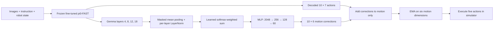

# pi0-FAST: from demonstrations to robot actions

**Fine-tune a vision-language-action model, smooth its actions, and learn a small residual controller.**

This repository contains our OpenPI experiments on **LIBERO-Spatial** and **MimicGen Square D0**. It includes local, editable VLA source, dataset preparation, LoRA fine-tuning, frozen-VLA feature caching, residual-controller training, and simulator evaluation.

Only three methods are supported for each dataset:

1. **VLA only:** the fine-tuned pi0-FAST policy generates robot actions.
2. **VLA + action EMA:** the same policy with exponential moving averaging of motion commands.
3. **VLA + action EMA + residual controller:** a small MLP corrects the frozen VLA's motion predictions; EMA smooths the corrected commands before execution.

## Results

Observed success rates on **100 evaluation episodes per dataset**:

| Selected method | LIBERO-Spatial | MimicGen Square D0 |
|:---|---:|---:|
| VLA only | **91%** (91/100), historical | **72%** (72/100) |
| VLA + action EMA | **91%** (91/100), final control β=0 | **76%** (76/100) |
| VLA + action EMA + residual controller | **96%** (96/100), final β=1 | **83%** (83/100) |

| Selected setting | LIBERO-Spatial | MimicGen Square D0 |
|:---|:---|:---|
| VLA checkpoint | 25k updates, checkpoint `24999` | approximately 50k updates, checkpoint `50000` |
| Effective VLA batch | 8 = microbatch 2 × accumulation 4 | 8 = microbatch 2 × accumulation 4 |
| EMA weight on previous command | λ = **0.2** | λ = **0.3** |
| Residual Gemma layers, one-based | **4, 8, 12, 18** | **4, 8, 12, 18** |
| Residual multiplier | β = 1.0 | β = 1.0 |

**Final LIBERO selection (2026-10-06):** the EMA-only control scored **91/100** and the verified nonzero epoch-22 controller scored **96/100**, using the same 25k VLA, λ=0.2, strict decoder validation, and initial-state index protocol. The earlier 94% EMA run and 97% zero-head run are not the selected final comparison.

| Final LIBERO paired outcomes | Count |
|:---|---:|
| Both succeed | 87 |
| Controller succeeds; control fails | 9 |
| Control succeeds; controller fails | 4 |
| Both fail | 0 |

We retain the **observed five-percentage-point difference**, with cross-run repeatability unresolved. Greedy token selection is deterministic in intent; identical end-to-end rollouts have not been established. Do not present the difference as a proven causal controller gain. The LIBERO VLA-only 91% and all three MimicGen scores are historical selected results, not a freshly repeated six-way comparison under one decoder version. The latest shared decoder adds strict byte validation; rerunning historical scores with it is a new protocol.

Each reported score uses 100 development-evaluation episodes, not an untouched test set. Checkpoints/settings were selected through repeated evaluation. Exact run directories, checkpoint identities, source-result hashes and the paired matrix are in [results/final_results.json](results/final_results.json). Intermediate checkpoint labels follow a zero-based loop: `50000` contains 50,001 updates.

## Contents

- [Model and methods](#model-and-methods)
- [Installation](#installation)
- [Download base weights and data](#download-base-weights-and-data)
- [LIBERO-Spatial](#libero-spatial)
- [MimicGen Square D0](#mimicgen-square-d0)
- [Train the residual controllers](#train-the-residual-controllers)
- [Evaluate the six combinations](#evaluate-the-six-combinations)
- [Checkpoint availability](#checkpoint-availability)
- [Outputs, reproducibility, and source map](#outputs-reproducibility-and-source-map)

## Model and methods

### VLA: pi0-FAST + FAST+

The inputs are an external RGB image, an eye-in-hand RGB image, a language instruction, and an eight-dimensional robot state: end-effector position (3), axis-angle orientation (3), and the two gripper finger positions. OpenPI resizes images to 224 × 224.

SigLIP encodes the images, and the Gemma-based VLM autoregressively predicts action tokens. FAST+ applies a temporal DCT independently to each action dimension, quantizes and flattens the coefficients, and encodes the sequence with BPE. Detokenization reverses BPE and quantization, applies inverse DCT, and then the policy's output transforms restore simulator command units. **The gripper is included in FAST tokenization.**

Each prediction is a **10 × 7 action chunk**: six delta-motion commands plus one gripper command. Evaluation executes five actions and observes again. VLA fine-tuning uses masked autoregressive token cross-entropy. We train **Gemma LoRA adapters and the full SigLIP vision backbone**; the original Gemma weights remain frozen. Trainable parameter counts are computed at runtime.

### Action EMA

For the six motion dimensions, immediately before the simulator step:

$$\tilde a_t = \lambda\tilde a_{t-1} + (1-\lambda)a_t.$$

The first action passes through unchanged. History persists across replanning boundaries and resets for each episode. The gripper is never smoothed. EMA changes inference behavior only; it requires no new VLA weights or training.

### Residual controller



The entire fine-tuned VLA stays frozen during controller training. Each selected Gemma layer supplies a 2,048-dimensional mean-pooled observation-prefix feature. Affine-free LayerNorm and four learned **global** softmax weights produce a weighted sum, rather than concatenation. A GELU MLP predicts bounded residuals for all ten timesteps of the six motion dimensions.

$$a^{\mathrm{corrected}}_{t,1:6}=a^{\mathrm{VLA}}_{t,1:6}+\beta\,\Delta a^{\mathrm{controller}}_{t,1:6}.$$

The gripper is copied from the VLA. EMA is applied **after residual addition**. Controller targets are `(demonstrated_motion − VLA_motion) / training_std`; the objective is masked normalized residual MSE plus a small squared-residual penalty. Demonstrated actions are targets only, never inputs to feature extraction. No EMA is applied to the offline targets.

## Installation

### Requirements and environment isolation

The experiments ran on Ubuntu 24.04 with an NVIDIA RTX 5090 (32 GB). Use a working NVIDIA driver with CUDA 12.8 compatibility; check it with `nvidia-smi`. This guide does **not** install a driver or modify system CUDA.

| Conda environment | Python | Purpose |
|:---|:---|:---|
| `pi0` | 3.11 | VLA training/inference, data conversion, controller caching/training |
| `libero` | 3.8 | LIBERO simulator and evaluation client |
| `mimicgen` | 3.8 | MimicGen simulator and evaluation client |

The evaluation launchers run a model server in `pi0` and a simulator client in its own environment, concurrently over localhost. You do not need to activate two environments in one shell. Offline training does not need the simulator running.

The model lock uses JAX 0.5.3, Flax 0.10.2, PyTorch 2.7.1+cu128 and torchvision 0.22.1+cu128. CUDA libraries are installed inside `pi0`; activation selects them in the current shell. Simulator PyTorch uses CPU wheels; NVIDIA EGL handles rendering.

> **Existing experiment machine:** `/home/kb/pi0_fast` is the original working project. This GitHub export is separate. Do not reinstall editable packages into your working `pi0` environment just to read this repository. The instructions below describe a fresh setup. Environment names must be unused, or deliberately changed consistently in the activation helpers and launchers.

### 1. Clone and configure paths

Install Conda using your preferred distribution if it is not already available. Clone this repository from its GitHub URL once published, then run from its root:

```bash
# Replace this path with your clone location.
cd /path/to/pi0_fast_github
export PROJECT_ROOT="$PWD"

# Configure source paths for THIS clone before creating caches or checkpoints.
python tools/configure_local_paths.py --conda-base "$(conda info --base)"
python tools/configure_local_paths.py --conda-base "$(conda info --base)" --apply

# Fetch the recorded simulator source revisions; no packages installed yet.
python tools/fetch_dependencies.py
```

The configuration helper previews changes first, replaces original project/Conda paths only inside this clone, and writes local LIBERO configuration. Use paths without spaces or shell metacharacters. It refuses to rewrite an existing checkpoint/cache workspace. **Run it before caching:** controller checkpoints authenticate feature-source hashes and absolute VLA paths. Moving an old head to a new checkout requires a validated migration; bypassing the checks is not part of this guide.

### 2. Create the model environment

```bash
conda create -n pi0 python=3.11 pip -y
conda activate pi0
python -m pip install uv
source "$PROJECT_ROOT/activate_pi0.sh"  # changes directory to openpi/

# Install the checked-in lock into the active Conda environment.
GIT_LFS_SKIP_SMUDGE=1 uv sync --frozen --inexact
uv pip install --python "$CONDA_PREFIX/bin/python" --no-deps -e .
# HDF5 conversion/caching helper dependency, recorded in the original environment.
uv pip install --python "$CONDA_PREFIX/bin/python" h5py==3.13.0
python -m pip check

cd "$PROJECT_ROOT"
python verify_gpu.py jax
python verify_gpu.py torch
```

`activate_pi0.sh` sets `UV_PROJECT_ENVIRONMENT` to Conda `pi0`, disables managed-Python downloads and JAX memory preallocation, and configures project-local caches. `resync_pi0.sh` reapplies the lock/editable installation later. Do not run an ordinary `uv sync` into an unintended `.venv`.

### 3. Create the simulator environments

The requirements files preserve the recorded simulator package versions. Editable source checkouts are installed separately with `--no-deps`, so they do not replace the pinned dependency stack.

```bash
cd "$PROJECT_ROOT"
conda create -n libero python=3.8 pip -y
conda activate libero
python -m pip install cmake==3.31.6
python -m pip install -r requirements/libero.txt
python -m pip install --no-deps -e openpi/third_party/libero -e openpi/packages/openpi-client
python -m pip check

conda create -n mimicgen python=3.8 pip -y
conda activate mimicgen
python -m pip install cmake==3.31.6
python -m pip install -r requirements/mimicgen.txt
python -m pip install --no-deps -e mimicgen_robosuite -e mimicgen_robomimic -e mimicgen -e openpi/packages/openpi-client
python -m pip check
```

LIBERO uses MuJoCo 3.2.3 / robosuite 1.4.1; MimicGen uses MuJoCo 2.3.2 and the recorded robosuite/robomimic Git revisions. Keep the environments separate. CMake/`egl_probe` needs a working compiler toolchain. EGL also needs the host NVIDIA driver libraries. The pinned Python 3.8 stack is historical; do not silently upgrade it when reproducing these experiments.

The original environments and simulations were tested. Fresh installation from this curated export has **not** been rerun end to end; setup helpers are syntax-checked, and experiment paths are verified against the working source. Full package records are in `provenance/environments/`.

## Download base weights and data

Return to the model environment for downloads and conversion:

```bash
source "$PROJECT_ROOT/activate_pi0.sh"
cd "$PROJECT_ROOT"
```

### Official pretrained checkpoint and tokenizer

```bash
python download_checkpoint.py
```

This downloads **`gs://openpi-assets/checkpoints/pi0_fast_base`** into `cache/openpi/openpi-assets/checkpoints/pi0_fast_base/`, verifies every object against GCS size/MD5 metadata, and reuses valid completed files. The official base is about **10.85 GB**. It is the initialization for VLA fine-tuning, not our task-specific trained policy.

The small FAST+ tokenizer/source snapshot is already included under `fast-tokenizer/`, from [physical-intelligence/fast](https://huggingface.co/physical-intelligence/fast), revision `ec4d7aa71691cac0b8bed6942be45684db2110f4`. No tokenizer fitting is needed. OpenPI may fetch additional language-tokenizer assets on the first online load; warm these before the training launchers enable offline mode:

```bash
python tokenizer_experiment.py --tokenizer fast_plus
python smoke_pi0_fast.py
```

The smoke test checks base-model GPU execution, not task success. Training, caches, and videos require additional disk space beyond the base download.

### LIBERO demonstrations

```bash
python download_libero_dataset.py
python verify_libero_dataset.py
python prepare_spatial_dataset.py
python compute_spatial_stats.py
```

The downloader uses [Physical Intelligence's LeRobot LIBERO conversion](https://huggingface.co/datasets/physical-intelligence/libero), pinned revision `9dfa69510ea9e1613fc54112bc706444b686a231`. It downloads approximately **34.94 GB**, containing 1,693 demonstrations / 273,465 frames across 40 tasks. Conversion then selects **all 432 demonstrations / 52,970 frames from the ten Spatial tasks**, reindexes episodes, and writes `datasets/lerobot/local/libero_spatial/`.

Images are embedded in Parquet (external and wrist cameras, 256 × 256). The source is already LeRobot v2.0; the subset script does not require raw HDF5 LIBERO downloads. It refuses to overwrite an existing subset. The pinned LeRobot reader supports the v2.0 statistics warning. Do not migrate the data format during reproduction.

### MimicGen demonstrations

```bash
python tools/download_mimicgen_data.py
python prepare_mimicgen_square.py
python compute_mimicgen_stats.py
python verify_mimicgen_data.py
python verify_mimicgen_tokens.py
```

The downloader retrieves **`core/square_d0.hdf5`** from [amandlek/mimicgen_datasets](https://huggingface.co/datasets/amandlek/mimicgen_datasets), revision `33016f8a62c02334f929f2913af8fdd2a8a129e1`, verifies its SHA-256, and creates the manifest required by conversion. The source is approximately **1.62 GB**, with **1,000 demonstrations / 153,477 frames**.

`prepare_mimicgen_square.py` converts all demonstrations to `datasets/lerobot/local/mimicgen_square_d0/`; it refuses to overwrite an existing output. The two 84 × 84 RGB streams are `agentview_image` and `robot0_eye_in_hand_image`. The fixed instruction is “pick up the square nut and place it onto the square peg”; it is supplied locally because the source is not language annotated.

**Action conventions matter:** MimicGen keeps the original seven OSC_POSE delta commands (`extra_delta_transform=False`). LIBERO retains the action transform used by the trained LIBERO model. Use the dataset-specific configuration and normalization assets; do not swap these between datasets. Simulator camera processing is also dataset-specific.

## LIBERO-Spatial

Use `pi0_fast_libero_spatial_lora` and launch a fresh 25k-update run:

```bash
cd "$PROJECT_ROOT"
bash train_spatial_25k.sh --dry-run
bash train_spatial_25k.sh
```

Initialization is official `pi0_fast_base` with a fresh optimizer. Effective batch 8 = microbatch 2 × four accumulation passes. The schedule uses 1,000 warmup updates, peak LR 2.5e-5, and cosine decay to 2.5e-6 at 25k. The run sees approximately 3.78 passes over Spatial frames.

Weights and optimizer state are saved under:

```text
checkpoints/pi0_fast_libero_spatial_lora/spatial_fast_plus_25k_b8_<timestamp>/
    10000/
    20000/
    24999/       ← selected final checkpoint
```

Save the **absolute checkpoint directory** printed by training as `LIBERO_CHECKPOINT`:

```bash
export LIBERO_CHECKPOINT="$PROJECT_ROOT/checkpoints/pi0_fast_libero_spatial_lora/<your_run>/24999"
```

Replace `<your_run>` with the real directory name. Pass the checkpoint directory, **not** its `params/` subdirectory. Training does not start evaluation automatically.

## MimicGen Square D0

The selected 50k checkpoint came from **20k fresh training, followed by a continuation with a 60k cosine endpoint**. Keep that schedule when reproducing the selected model; shortening the decay endpoint to 50k changes the recipe.

```bash
cd "$PROJECT_ROOT"
bash train_mimicgen_square.sh --dry-run
bash train_mimicgen_square.sh

# Use the complete 20k checkpoint, including optimizer state.
export MIMICGEN_20K_CHECKPOINT="$PROJECT_ROOT/checkpoints/pi0_fast_mimicgen_square_lora/<your_20k_run>/19999"
bash continue_mimicgen_square.sh --dry-run
bash continue_mimicgen_square.sh
```

The first stage uses effective batch 8, microbatch 2, accumulation 4, 1,000 warmup steps, peak LR 2.5e-5 and a cosine endpoint of 2.5e-6 at 20k. Continuation copies the source checkpoint into a new experiment, restores model/Adam state and counters, and restarts LR at **2e-5 at global step 20k**, with **no warmup**, decaying to **2e-6 at 60k**. It saves `30000`, `40000`, `50000`, and `59999`.

For all three selected MimicGen methods, use **`50000`**, not the continuation's final `59999`:

```bash
export MIMICGEN_CHECKPOINT="$PROJECT_ROOT/checkpoints/pi0_fast_mimicgen_square_lora/<your_continuation_run>/50000"
```

The unchanged continuation launcher runs to 60k to preserve the original schedule; the selected 50k checkpoint is retained. The fresh shuffled data loader in continuation means this is not a bit-for-bit uninterrupted run. The selected model has seen approximately 2.61 dataset passes.

## Train the residual controllers

First choose the appropriate **fine-tuned** VLA checkpoint variables above. The original `pi0_fast_base` is not the frozen policy for controller training.

### LIBERO

```bash
cd "$PROJECT_ROOT"
bash cache_libero_residual.sh --dry-run
bash cache_libero_residual.sh
# Preserve the source cache and create the audited training cache.
python audit_residual_cache.py \
  --cache cache/libero_residual_25k_stride5_fp32 \
  --output cache/libero_residual_25k_stride5_fp32_decode_checked \
  --report setup_logs/libero_residual/decode_cache_audit.json
bash train_libero_residual.sh
```

### MimicGen

```bash
cd "$PROJECT_ROOT"
bash cache_mimicgen_residual.sh --dry-run
bash cache_mimicgen_residual.sh
bash train_mimicgen_residual.sh
```

Both launchers train a **fresh** four-layer controller with the same masked MSE objective and optimization settings. There is no Huber loss. A freshly generated cache already uses strict byte validation; auditing also supports historical caches by identifying the confirmed U+FFFD corruption from reconstructed DCT coefficients. It preserves the source and does not claim to recover every possible malformed token sequence, because historical caches contain actions rather than token IDs.

For the final LIBERO run, the audit excluded two additional corrupt training windows, leaving 9,598 valid training and 1,065 valid validation windows. No validation windows were removed. The final head was epoch 22 (early stopping after epoch 32); validation MSE improved from 0.0778813903 to 0.0770160145, about 1.11%. All 10,761 cached observations were tested for finite, nonzero head outputs.

Selected training recipe:

| Setting | Value |
|:---|:---|
| Frozen features | Gemma blocks 4, 8, 12, 18; four 2048D vectors |
| Cache precision / sampling | float32; one window every 5 frames in every demo |
| Architecture | LayerNorm → learned softmax mix → MLP 2048–256–128–60 |
| Optimizer | AdamW, LR 1e-3, weight decay 1e-4, gradient norm clipping 1 |
| Batch / seed | 256 / 42 |
| Training limit | 100 epochs, early-stop patience 10 |
| Residual scale | tanh output × training motion standard deviation; β=1 at evaluation |
| Regularization | 1e-3 squared normalized residual penalty |
| Checkpoint selection | lowest validation normalized motion MSE; LIBERO selects from nonzero trained epochs |

Caching performs real greedy VLA inference; expect hours on the original GPU for MimicGen. Training the MLP on the cached features takes only minutes or less. Caches record dataset/checkpoint/code provenance and resume only matching incomplete runs. Invalid VLA chunks are recorded and excluded from controller fitting. Tail padding is masked out of the loss.

| Dataset | Cached windows | Controller demo split |
|:---|---:|:---|
| LIBERO-Spatial | 10,761 | 389 train / 43 validation, stratified by task |
| MimicGen Square D0 | 31,275 | 900 train / 100 validation |

The frozen VLA previously trained on **all** demonstrations. These are controller-level validation splits, not held-out data for the complete system. Lower offline MSE does not guarantee higher simulator success.

Weights save under `checkpoints/libero_residual/libero_residual_25k_decode_checked_<timestamp>/` and `checkpoints/mimicgen_residual/residual_50k_<timestamp>/`. Each run saves `best.pt`, `last.pt`, `metrics.jsonl`, and `training_summary.json`. The LIBERO launcher saves initialization separately as `zero_reference.pt`, explicitly selects a trained nonzero head, and reports whether it beats the zero-reference validation MSE. The selected final head did. MimicGen retains its original checkpoint-selection recipe; the selected epoch-48 head is nonzero. Preserve the selected `best.pt` and its matching VLA checkpoint together.

## Evaluate the six combinations

Set `LIBERO_CHECKPOINT` and `MIMICGEN_CHECKPOINT` to the selected trained checkpoint directories. Set the two head paths to the `best.pt` files printed by controller training:

```bash
export LIBERO_HEAD="$PROJECT_ROOT/checkpoints/libero_residual/<your_run>/best.pt"
export MIMICGEN_HEAD="$PROJECT_ROOT/checkpoints/mimicgen_residual/<your_run>/best.pt"
cd "$PROJECT_ROOT"
```

Run one evaluation at a time. The `env -u` prefixes prevent inherited shell variables from accidentally enabling a residual or smoothing method.

| Dataset | Method | Command |
|:---|:---|:---|
| LIBERO | VLA only | `env -u ACTION_EMA_LAMBDA -u RESIDUAL_CONTROLLER bash eval_spatial.sh "$LIBERO_CHECKPOINT"` |
| LIBERO | VLA + EMA 0.2, final matching control | `RESIDUAL_BETA=0 bash eval_libero_residual.sh "$LIBERO_HEAD"` |
| LIBERO | VLA + EMA 0.2 + residual | `RESIDUAL_BETA=1.0 bash eval_libero_residual.sh "$LIBERO_HEAD"` |
| MimicGen | VLA only | `env -u ACTION_EMA_LAMBDA -u RESIDUAL_CONTROLLER bash eval_mimicgen_square.sh "$MIMICGEN_CHECKPOINT"` |
| MimicGen | VLA + EMA 0.3 | `env -u RESIDUAL_CONTROLLER bash eval_mimicgen_action_ema.sh "$MIMICGEN_CHECKPOINT"` |
| MimicGen | VLA + EMA 0.3 + residual | `RESIDUAL_BETA=1.0 bash eval_mimicgen_residual.sh "$MIMICGEN_HEAD"` |

For the final LIBERO experiment, `bash eval_libero_controller_compare.sh control` and `bash eval_libero_controller_compare.sh` are short alternatives. The exported `LIBERO_HEAD` overrides its default selected epoch-22 path in this GitHub copy. Both modes use the feature-extraction path; only β changes. The legacy printed label may still say `residual-mlp+action-ema` at β=0: that control executes **no residual correction**. Standalone `eval_action_ema.sh` remains available but was not the launcher used for the final 91% control.

The residual wrappers read the corresponding exported VLA checkpoint variable. If unset, they use the original selected run names documented below. A head is rejected if its base checkpoint, feature code, dataset, or layer selection does not match. Append `--dry-run` to preview; residual previews require an existing head, and training previews require prepared inputs.

| Evaluation setting | LIBERO-Spatial | MimicGen Square D0 |
|:---|:---|:---|
| Episodes | 10 tasks × 10 initial states | 1 task × 100 reset seeds |
| Initialization | seed 7; first ten standard states/task | seed 100000 + episode index |
| Maximum control steps | 220 | 400 |
| Generation | greedy, temperature 0 | greedy, temperature 0 |
| Replanning | predict 10, execute 5 | predict 10, execute 5 |
| Success | benchmark task success | robomimic task-success predicate |

For a quick smoke rollout, prefix a LIBERO command with `EPISODES_PER_TASK=1`, or a MimicGen command with `EPISODES=5`. These smaller evaluations are not comparable to the table's 100-episode results.

FAST token IDs, strict UTF-8 byte decoding, coefficient count, and replacement characters are checked before interpreting DCT coefficients. Malformed chunks use the existing normalized-zero fallback and are counted. Validation version `fast-bytelevel-strict-utf8-v1` is recorded in evaluation metadata. The residual is bypassed for those chunks. A fallback does not automatically end an episode, and zeros in normalized space are not necessarily a physical “hold still” command.

## Checkpoint availability

**No trained weights, datasets, feature caches, or evaluation videos are included in this Git repository.** The selected weights are hosted separately on Hugging Face.

### Download the selected trained models

The four selected inference artifacts are public at [kaushikb258/pi0-fast-libero-mimicgen](https://huggingface.co/kaushikb258/pi0-fast-libero-mimicgen).
Verified immutable revision: `a48a4a0850e9f253113afe0cb54ab67d35d639e1`. Approximately **11.16 GB** total.
This contains both VLA parameter trees and normalization assets, plus the LIBERO
**epoch-22 (96%)** and MimicGen **epoch-48 (83%)** residual heads. Optimizer states,
datasets, feature caches and videos are excluded. Exact training continuation
requires your original full checkpoint, not this inference release.

In the `pi0` environment, download separately from the source checkout:

```bash
export MODEL_ROOT="$HOME/pi0-fast-models"
python - <<'PY_DOWNLOAD'
import os
from huggingface_hub import snapshot_download
snapshot_download(
    repo_id="kaushikb258/pi0-fast-libero-mimicgen",
    revision="a48a4a0850e9f253113afe0cb54ab67d35d639e1",
    local_dir=os.environ["MODEL_ROOT"],
)
PY_DOWNLOAD
```

For a newly configured code checkout, set `PROJECT_ROOT` to its absolute path.
Then bind local copies of the heads to the downloaded VLA paths:

```bash
python "$MODEL_ROOT/prepare_downloaded_controller.py" --release "$MODEL_ROOT" --project "$PROJECT_ROOT" --dataset libero
python "$MODEL_ROOT/prepare_downloaded_controller.py" --release "$MODEL_ROOT" --project "$PROJECT_ROOT" --dataset mimicgen
export LIBERO_CHECKPOINT="$MODEL_ROOT/libero/vla"
export LIBERO_HEAD="$MODEL_ROOT/libero/controller/best.local.pt"
export MIMICGEN_CHECKPOINT="$MODEL_ROOT/mimicgen/vla"
export MIMICGEN_HEAD="$MODEL_ROOT/mimicgen/controller/best.local.pt"
```

The helper verifies checksums and source equivalence (allowing configured root
paths), updates only path/source-hash metadata, and confirms every tensor stays
identical. It leaves downloaded `best.pt` files untouched. Use the curated
`pi0_fast_github` wrappers for the environment-variable overrides above; original
working-folder wrappers still use the original local VLA paths. Follow the six
training/evaluation combinations in the curated README. A full clean-machine
simulator evaluation of these downloaded artifacts has not been performed.

The HF [release manifest](https://huggingface.co/kaushikb258/pi0-fast-libero-mimicgen/blob/a48a4a0850e9f253113afe0cb54ab67d35d639e1/release_manifest.json) records
per-file SHA-256 values. The model card describes historical-result caveats.


Only **four model artifacts** are needed for all six results. Baseline and EMA share exactly the same VLA weights; EMA has no checkpoint.

| Artifact | Selected original path, relative to the original project |
|:---|:---|
| LIBERO VLA, shared by three methods | `checkpoints/pi0_fast_libero_spatial_lora/spatial_fast_plus_25k_b8_20260919_163905/24999` |
| LIBERO trained residual head, 96%, epoch 22 | `checkpoints/libero_residual/libero_residual_25k_decode_checked_20261006_145418/best.pt` |
| MimicGen VLA, shared by three methods | `checkpoints/pi0_fast_mimicgen_square_lora/mimicgen_square_fast_plus_continue_60k_b8_20260920_190251/50000` |
| MimicGen residual head, 83% | `checkpoints/mimicgen_residual/residual_50k_20260925_072837/best.pt` |

Keep `params/` **and** the matching `assets/` normalization files for inference. Full optimizer/training-state files are needed for continuation. Use the checked relocation helper above for downloaded controllers; copying a `best.pt` alone to an arbitrary VLA path does not satisfy the compatibility checks.

## Outputs, reproducibility, and source map

Training prints dynamic parameter counts, progress, checkpoint paths, and elapsed time; logs are in `setup_logs/training/<run>/`. Controller logs are in `setup_logs/residual/` or `setup_logs/libero_residual/`.

Evaluations write a new `evaluation/<method>_<timestamp>/` directory with:

- `result.json`: aggregate and episode/task success, decode validity, and method metadata.
- MP4 videos with external and wrist views.
- Raw/pre-EMA and executed command arrays, states, and command-change RMS metrics.
- Model-server and simulator logs; LIBERO episodes are grouped by task.

“Raw” in residual evaluations means after residual addition but before EMA. The command-change RMS measures differences between consecutive commanded actions; it is not physical jerk.

```text
openpi/                         Editable VLA, LoRA, training and policy code
fast-tokenizer/                  FAST+ DCT/BPE tokenizer snapshot
requirements/                   Recorded simulator package requirements
tools/                          Source fetch, path configuration, MimicGen download
prepare_*dataset.py             LIBERO-Spatial subsetting
prepare_mimicgen_square.py       HDF5 → LeRobot conversion
train_*.sh / continue_*.sh       Selected VLA and controller recipes
cache_*residual.*                Frozen-VLA features and prediction caches
residual_controller.py          MLP, feature mixing, residual loss
residual_policy.py              Frozen Gemma features and residual inference
libero_residual_*.py             LIBERO-specific cache and policy adapters
action_ema.py                    Constant EMA on six motion dimensions
eval_*.sh / evaluate_*.py        Six selected evaluation combinations
provenance/                     Upstream revisions, original records, curation audit
```

The remaining top-level shell scripts support only these six combinations or their required setup/training/cache stages. Adaptive/hybrid filtering, alternative residual layer sets, and unrelated pilot/100k launchers have been removed from this export. The bundled upstream OpenPI tree still contains its standard examples and configurations; those are not additional reported experiments.

Basic checks in `pi0`:

```bash
python test_action_ema.py
JAX_PLATFORMS=cpu python -m unittest test_residual_controller test_libero_residual
```

This README is the single maintained guide for the project. READMEs within `openpi/` and `fast-tokenizer/` are retained upstream documentation.

Checkpoint/cache source-hash checks remain active. Original export hashes are in `provenance/source_manifest.json`; the curated release inventory is in `provenance/current_manifest.json`. Local path configuration intentionally changes some source hashes before new caches are created. `.gitignore` excludes runtime artifacts and local configuration.

`provenance/source_manifest.json`, `provenance/path-audit.json`, and `provenance/openpi-local-changes.patch` describe the initial export before curation; `provenance/curation.json` records removed experiments and documentation cleanup. The `provenance/notes/` and `provenance/environments/` folders are historical records; follow this README for the maintained pipeline.

### Upstream projects and attribution

- [Physical Intelligence OpenPI](https://github.com/Physical-Intelligence/openpi): source snapshot `215abfb217dbac7d5f1273282331b9b1866c0479` plus local changes; license retained at `openpi/LICENSE`.
- [FAST / FAST+](https://huggingface.co/physical-intelligence/fast): upstream model card and tokenizer files retained.
- [LIBERO](https://github.com/Lifelong-Robot-Learning/LIBERO): independent manipulation benchmark; demonstrations used through Physical Intelligence's LeRobot conversion.
- [MimicGen](https://github.com/NVlabs/mimicgen), [robosuite](https://github.com/ARISE-Initiative/robosuite), and [robomimic](https://github.com/ARISE-Initiative/robomimic): pinned simulator sources fetched separately, subject to their upstream licenses.

The [four selected models](https://huggingface.co/kaushikb258/pi0-fast-libero-mimicgen) are public and verified at revision `a48a4a0850e9f253113afe0cb54ab67d35d639e1`. This code-only GitHub export has not yet been pushed to GitHub.

No new license for the original experiment code is assigned by this export. Retain upstream notices and review dataset/model licenses before redistribution.
